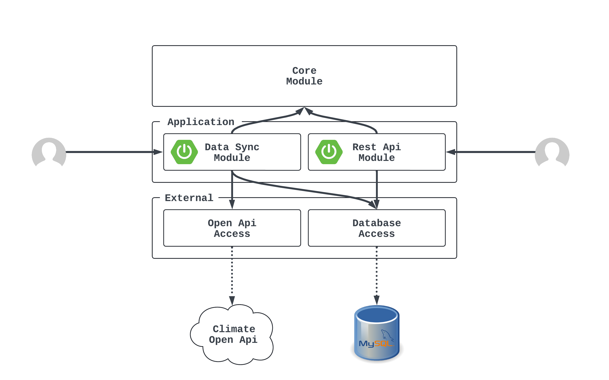

# 사전 과제 - (주)빅스

[(주)빅스 입사지원 사전과제](https://boiling-monday-b76.notion.site/Bigs-Back-End-612467e0c1f1435dac2023bad0c84ecc)

> ### 개발환경
> OS: macOS 14.5  
> Lang: Java17  
> Framework: SpringBoot 3.2.5  
> Libraries: Spring Data JPA, Testcontainers  
> Open API: [기상청_단기예보 조회 서비스](https://www.data.go.kr/data/15084084/openapi.do)  
> DB: MySQL 8.0.33  
> etc.: Docker

## 프로그램 구동

- `도커엔진`이 설치되어있어야 빌드와 테스트가 수행됩니다.
- 아래 `필수 환경변수` 목록을 추가해야 실행 가능합니다.
- 프로그램 실행을 위한 외부 MySQL 프로세스가 동작하고 있어야합니다.

### 필수 환경변수 안내

- `MYSQL_DRIVER_CLASS_NAME`: 데이터베이스 연동을 위한 드라이버 클래스 이름 ex) `com.mysql.cj.jdbc.Driver`  
- `MYSQL_URL`: 데이터베이스 접근 url ex) jdbc.mysql://localhost:3306/{DB name}  
- `MYSQL_USERNAME`: 데이터베이스 계정
- `MYSQL_PASSWORD`: 데이터베이스 비밀번호

## 모듈 구조와 요청 흐름



```text
프로젝트 계층 구조

project-root
├─ core
├─ application
│  └─ data-sync
│  └─ rest
└─ external
   └─ mysql
   └─ open-api-climate
```

## Additionally...

- [[테스트 코드] 테스트 컨테이너 관련 테스트를 비활성화 하고싶은 경우](modules-external/module-mysql/src/test/java/org/example/bigs/pretest/mysql/test/unit/ForecastRepositoryTest.java)

